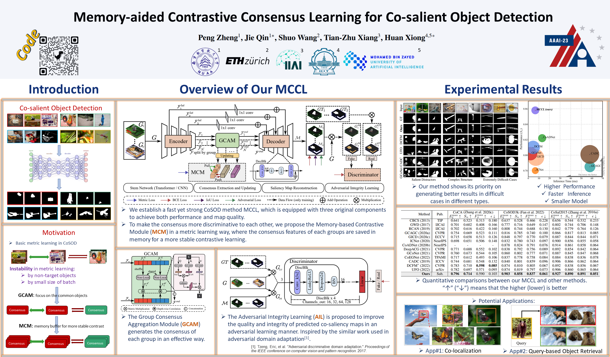

## Memory-aided Contrastive Consensus Learning for Co-salient Object Detection

> [**Memory-aided Contrastive Consensus Learning for Co-salient Object Detection**](https://arxiv.org/abs/2302.14485)  
> Peng Zheng, Jie Qin, Shuo Wang, Tian-Zhu Xiang, Huan Xiong  
> *AAAI2023 ([AAAI](#), [arXiv](https://arxiv.org/abs/2302.14485))*

### Overview



### Abstract

Co-Salient Object Detection (CoSOD) aims at detecting common salient objects within a group of relevant source images. Most of the latest works employ the attention mechanism for finding common objects. To achieve accurate CoSOD results with high-quality maps and high efficiency, we propose a novel Memory-aided Contrastive Consensus Learning (MCCL) framework, which is capable of effectively detecting co-salient objects in real time (∼150 fps). To learn better group consensus, we propose the Group Consensus Aggregation Module (GCAM) to abstract the common features of each image group; meanwhile, to make the consensus representation more discriminative, we introduce the Memory-based Contrastive Module (MCM), which saves and updates the consensus of images from different groups in a queue of memories. Finally, to improve the quality and integrity of the predicted maps, we develop an Adversarial Integrity Learning (AIL) strategy to make the segmented regions more likely composed of complete objects with less surrounding noise. Extensive experiments on all the latest CoSOD benchmarks demonstrate that our lite MCCL outperforms 13 cutting-edge models, achieving the new state of the art (∼5.9% and ∼6.2% improvement in S-measure on CoSOD3k and CoSal2015, respectively).

### Prerequisites

```
Python=3.8
!pip install -r requirements.txt
PyTorch==1.13.1
```

### Usage

The way to run this project is similar to our previous work [GCoNet+](https://github.com/ZhengPeng7/GCoNet_plus).

+ Train->test->eval: Run `go.sh` to go through training->testing->evaluation: `./go.sh METHOD_NAME WHICH_CUDA`.
+ If you want to use the PVT_v2_b2 backbone as ours ([the PVT repo](https://github.com/whai362/PVT/tree/v2/classification#model-zoo)), save [it](https://drive.google.com/file/d/1snw4TYUCD5z4d3aaId1iBdw-yUKjRmPC/view) as it is in the `config.py`. Not necessary if you only want to do the inference.
+ Fast test+eval: Put the weights in `ckpt/METHOD_NAME/xx.pth`, change the params of `epoch, val_last` in `go.sh`, comment the codes for training, and run this script. For example, if you want to eval the weights of the method `tmp_method` at `epoch 100`, make sure that weights are in `ckpt/tmp_method/ep100.pth`, and change `epochs and val_last` in `go.sh` as `100, 1`, respectively.

### Outputs

You can find our weights and predicted maps on both [google-drive](https://drive.google.com/drive/u/0/folders/1zH1biBDPCA0u2PJSQCeJTY9csnKFeY39) and [release](https://github.com/ZhengPeng7/MCCL/releases/tag/v0.7) of this repo.

### Acknowledgement

We highly recommend use the metric codes from [py_sod_metrics](https://github.com/lartpang/PySODMetrics/blob/main/py_sod_metrics/sod_metrics.py) and thanks to the codes of drawing the picture of accuracy-speed in [DGNet](https://github.com/GewelsJI/DGNet). This repo is based on our previous project [GCoNet+](https://github.com/ZhengPeng7/GCoNet_plus).

### Citation

```
@inproceedings{zheng2022mccl,
  title = {Group Collaborative Learning for Co-Salient Object Detection},
  author = {Zheng Peng, Qin Jie, Wang Shuo, Xiang Tian-Zhu and Xiong Huan},
  booktitle = {AAAI},
  year = {2023}
}
```

### Contact

Feel free to send e-mails to me ([zhengpeng0108@gmail.com](mailto:zhengpeng0108@gmail.com)).
